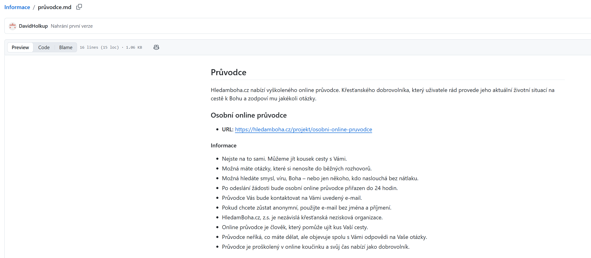
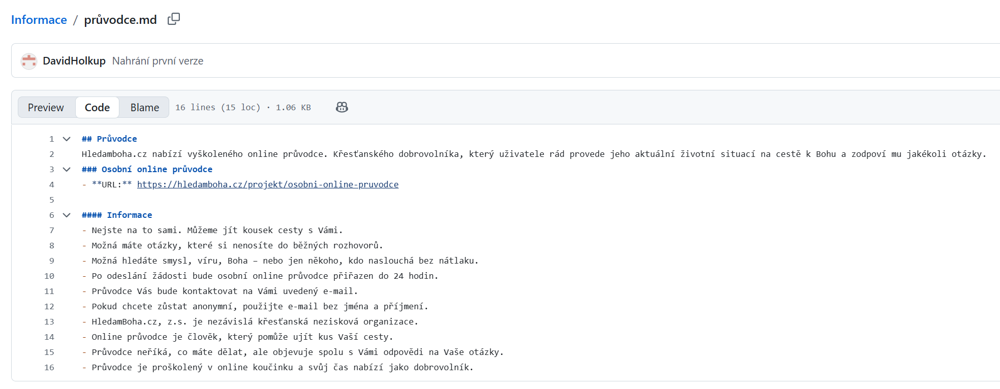
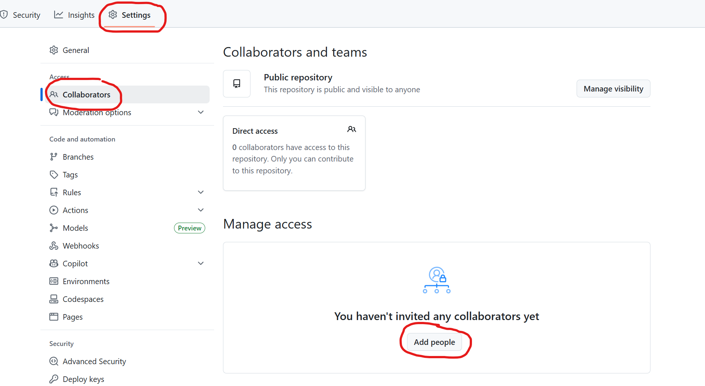
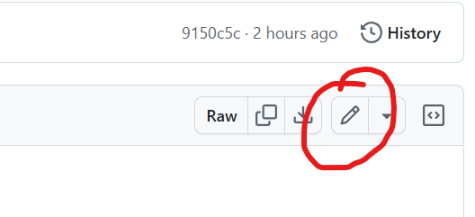
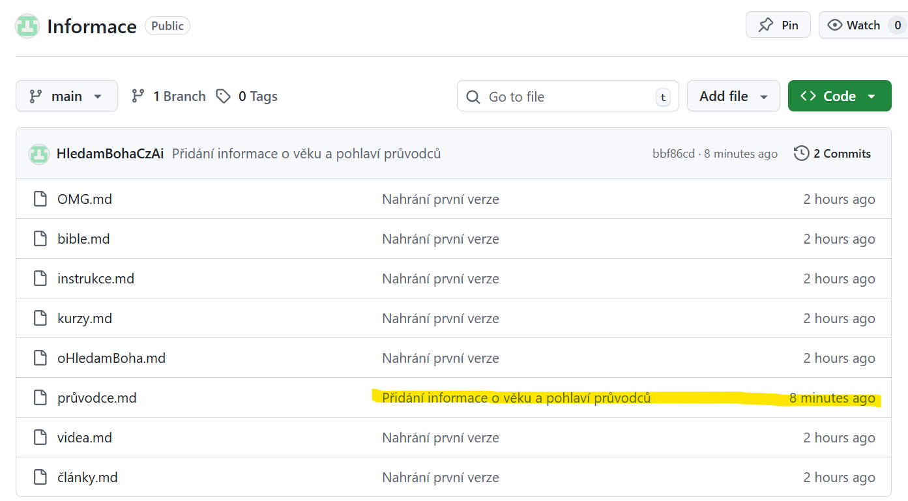
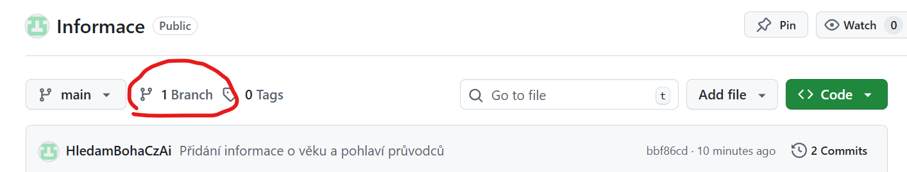
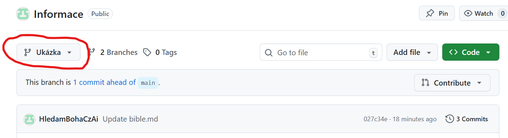
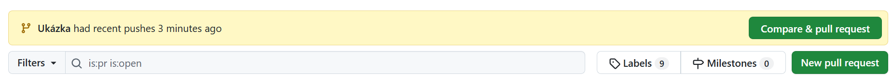
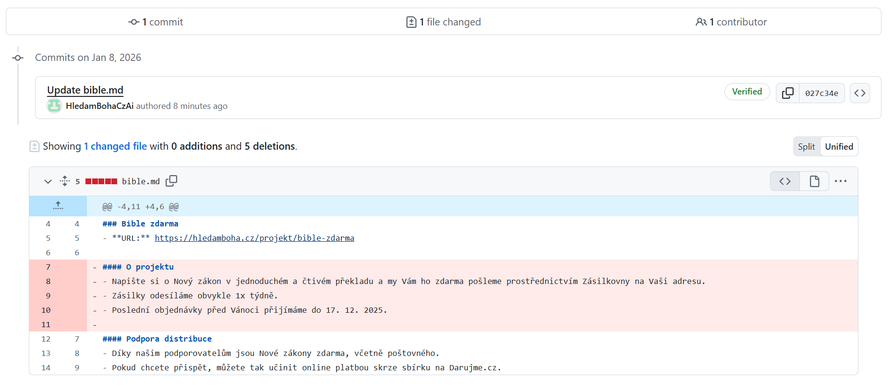
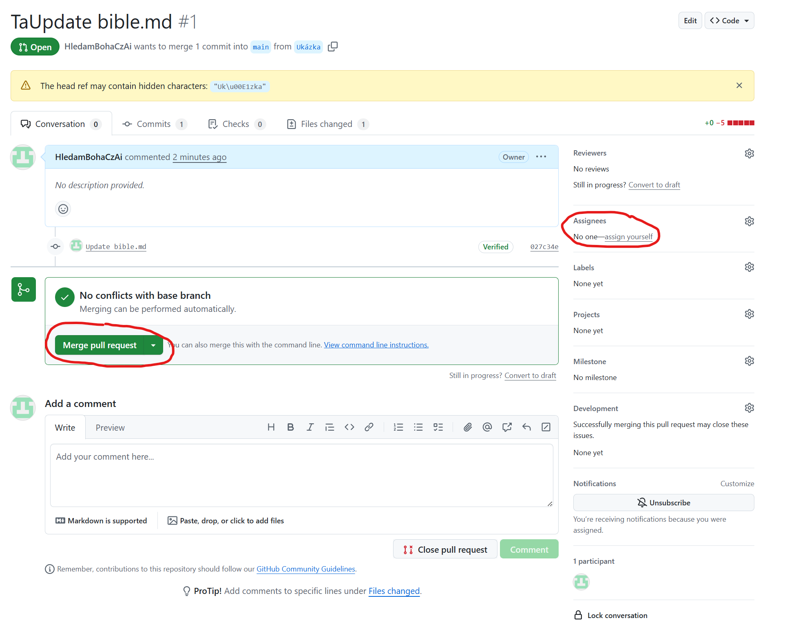

# Co a jak
Tento repositář obsahuje informace, které se posílají chatbotovi na stránkách hledamboha.cz.
Ten tyhle informace používá, aby mohl uživatelům správně a informovaně odpovídat.

Změny, které tu v souborech provedete (v hlavní větvi main) jsou okamžitě dostupné. Chatbot je dostane hned, když si uživatel načte hledamboha.cz.

Všechny informace jsou uložené jako markdown dokumenty s koncovkou `.md` a to co si právě prohlížíte je git repositář.

## Markdown
Výhodou Markdown formátu je, že je dobře čitelný pro lidi i pro stroje.
Když si otevřete jakýkoli `.md` soubor výše, například `průvodce.md`, uvidíte obsah hezky naformátovaný pro čtení lidmi.

V levo nahoře je přepínač. Teď je vypráno `Preview` na čtení lidmi, když vybereme `Code` uvidíme skutečný obsah souboru, takhle ho čtou stroje. V záložce `Blame` vidíme, kdo kdy naposledy změnil který řádek souboru.

## Úpravy v Gitu

### Než začneš s úpravami
Přihlaš se do githubu. Klidně můžeš použít svůj email na hledamboha.cz a přihlášení přes google.
Až se tvůj účet vytvoří, napiš mi (david4@hledamboha.cz), nebo někomu, kdo už přístup má a my ti dáme přístup.

Pokud chceš někomu dát přístup, tak v nastavení.

### malilinkaté změny
Pro malilinkaté změny stačí, když
1. V pravo nahoře kliknete na ikonu s tužkou. .
2. Upravíte soubor jak potřebujete.
3. Kliknete na `Preview`, abyste se ujistili, že soubor je pořád správně formátovaný, tak jak jste zamýšleli.
4. V pravo nahoře kliknete na `Commit changes`
5. Do `Commit message` napíšete jednoduchou větu o tom, co jste změnili. Napřiklad "Přidání informace o věku a pohlaví průvodců" nebo "Smazání kurzu XYZ".
6. Klikni na `Commit`

A je to! Pokud jsi nechal v předchozím dialogu zaškrtnuto `Commit directly to main`, pak je tvoje změna už teď veřejná a uživatelům hledamboha.cz se promítá do kontextu, který chatbot má.

### Větší změny
Protože všechno, co je v hlavní větvi je okamžitě nasazené do ostré verze, __NEDOPORUČUJI__ commitovat přímo do větve `main` jako v předchozím případě.
Správnější je vytvořit novou větev, ve které udělám všechny změny, které chci. To může být i v rámci více souborů.
Až když jsem změnil všechno, co jsem změnit chtěl (tím, že jsem dělal commity), vytvořím pull request do větve hlavní.

1. Vytvoř větev (branch). Nahoře klikni na `Branch` a pak v pravo nahoře `New Branch`
2. Klikni na branch, kterou jsi právě vytvořil. Vrátíš se zpět na původní zobrazení se soubory, ale teď jsi ve svojí větvi. Tady jsi v bezpečí. Jakékoli změny, které tu uděláš jsou jenom ve tvé větvi a k uživateli se nedostanou. 
3. Upravuj soubory stejným způsobem jako v sekci `malilinkaté změny`.
4. Když už jsi upravil všechno, co jsi chtěl a jsi se sebou spokojený, je čas své změny "spojit" (mergnout) s hlavní větví.
5. V levo nahoře klikni `Pull requests`.
6. Možná vidíš svoji větev hned nahoře, pokud ano klikni na `Compare & pull request`, pokud ne klikni na `New pull request` a vyber svoji větev 
7. Tady uvidíš všechny změny, které jsi ve své větvi udělal. To je užitečné, můžeš si to po sobě zkontrolovat. Já jsem například, jenom pro ukázku smazal řádky 7 až 11 ze souboru `bible.md`
8. Po vytvoření pull requestu můžeš už svoje změny mergnout, tím se dostanou do hlavní větve všechny najednou. Máš taky možnost někoho k pull requestu assignout. Ten člověk má potom za úkol tvoje změny zkontrolovat a schválit nebo odmítnout (dřív než je mergneš).
9. 